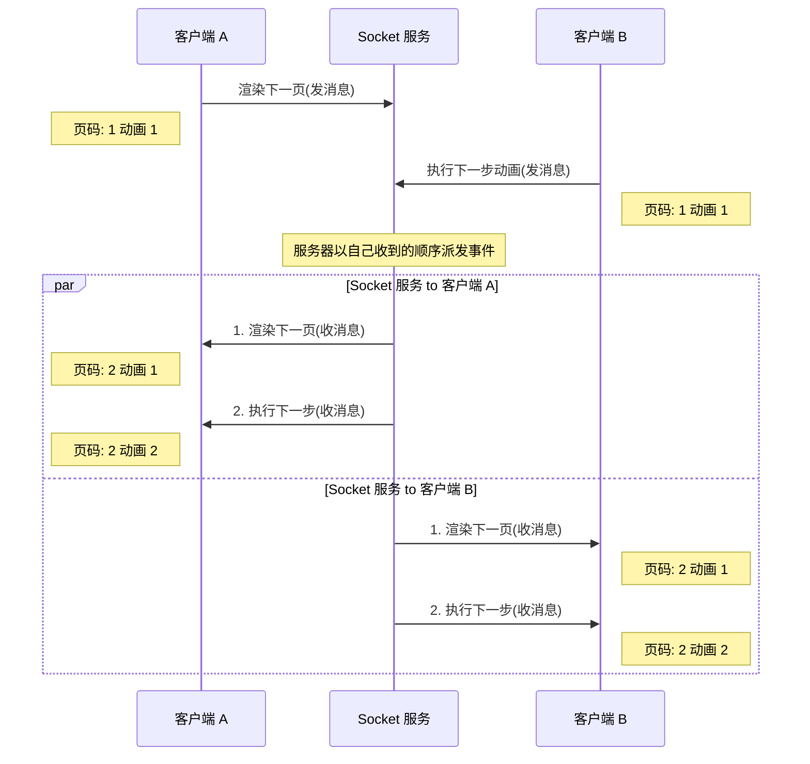
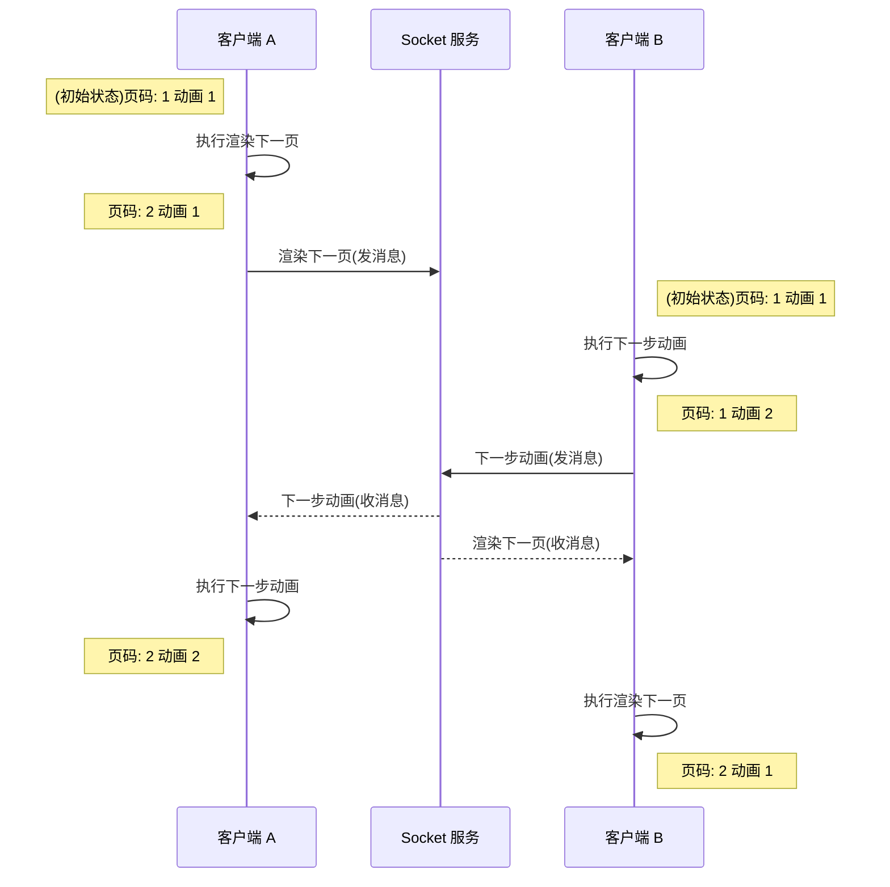

# netless-slide demo

这个项目是 `@netless/slide` 库的前端示例, 需要已经完成文档转换并且获取了 `taskId` 和 `prefixUrl` 才能进一步使用 `@netless/slide` 在浏览器中展示 ppt。

[在线演示](https://netless-io.github.io/netless-slide-demo/)

## 基本使用

### 初始化 `Slide` 对象

要初始化 `Slide` 对象, 至少要指定三项配置

|  key   | type  | description |
|  ----  | ----  | ---         |
| anchor | HTMLElement | 作为 `Slide` 渲染出的 `canvas` 元素的挂载点 |
| interactive  | boolean |ppt 是否可交互, 不可交互的 ppt 无法响应用户的事件|
| mode  | "local" &#124; "interactive" |local: 单机模式, Slide 对象不会触发任意同步事件。<br/>interactive: 互动模式, 所有客户端都可以交互|

```javascript
import { Slide } from "@netless/slide";

const slide = new Slide({
    anchor: someDivElement,
    interactive: true,
    mode: "local",
});
```

### 设置转换资源

`Slide` 对象创建之后, 下一步需要设置转换后的资源。`taskId` 为一串 hash 字符串代表一次转换任务 id, `prefixUrl` 为一段 url 地址, 指向转换后的资源根路径。这两个参数都可以从 [转码服务的进度查询 api](https://developer.netless.link/server-zh/home/server-conversion) 中获取.

`注意`: 你需要保证访问 prefixUrl 路径里的资源不会跨域。

```javascript

slide.setResource("06415a307f2011ec8bdc15d18ec9acc7", "https://convertcdn.netless.group/dynamicConvert");

```

### 渲染 ppt 页面

设置好转换资源后，就可以调用 `renderSlide` 渲染页面了, 传入参数是 ppt 页码, 页码从 1 开始。你也可以调用 `renderSlide` 跳转到任意页码。  
你需要确保传入的页码在原始 ppt 页数范围内, 访问 `slide.slideCount` 可以获取总页数 

```javascript
// 渲染第一页
slide.renderSlide(1);

// 渲染最后一页
slide.slideCount(slide.slideCount);
```
## 可选配置项

### `Slide` 配置

初始化 `Slide` 还有一些可选的配置项，说明如下

```javascript
const slide = new Slide({
    anchor: someDivElement,
    interactive: true,
    mode: "local",
    // 以下为可选配置
    resize: false,
    enableGlobalClick: false,
    timestamp: Date.now,
    renderOptions: {
        
    }
});
```

|  key   | type  | description |
|  ----  | ----  | ---         |
| resize  | boolean | **默认值:** false <br/> 设置是否根据窗口大小自动调整分辨率。<br/> 默认情况下 ppt 的 css 尺寸会随着 anchor 元素的大小而变化, 但是 canvas 元素的渲染分辨率不会变化。将此值设置为 true, 会使 canvas 的分辨率也跟随缩放比例缩放，这样能获得更好的性能，但是当 anchor 的 css 尺寸太小的情况下，也会导致画面模糊。<br /> 除非遇到性能问题，一般不建议设置为 true 。|
| enableGlobalClick  | boolean |**默认值:** false <br/> 用于控制是否可以通过点击 ppt 画面执行下一步功能。<br /> 建议移动端开启，移动端受限于屏幕尺寸，交互 UI 较小，如果开启此功能会比较方便执行下一步。|
| timestamp  | () => number |**默认值:** Date.now <br/> 此函数用于获取当前时间, 在同步及互动场景下，ppt 内部需要知道当前时间，这个时间对于参与同步(互动)的多个客户端应该是一致的，这个时间越精确，画面同步也越精确。<br />建议通过后端服务，为多个客户端下发相同的时间。|
| rtcAudio  | RtcAudioClazz |**默认值:** null <br/> 用于 rtc 混音, 具体用法见下文 |
| logger  | ILogger |**默认值:** null <br/> 用于接受日志, 具体用法见下文 |
| useLocalCache  | boolean |**默认值:** true <br/> 是否启用本地缓存，启用后会将 ppt 远程资源缓存在 indexDB 中 |
| renderOptions  | ISlideRenderOptions 对象 | 见下表 |

### ISlideRenderOptions 配置

|  key   | type  | description |
|  ----  | ----  | ---         |
| minFPS | number | **默认值:** 30 <br/> 设置最小 fps, 应用会尽量保证实际 fps 高于此值, 此值越小, cpu 开销越小。 |
| maxFPS | number | **默认值:** 40 <br/> 设置最大 fps, 应用会保证实际 fps 低于此值, 此值越小, cpu 开销越小。 |
| resolution | number | **默认值:** pc 浏览器为 window.devicePixelRatio; 移动端浏览器为 1 。<br/> 设置渲染分辨倍率, 原始 ppt 有自己的像素尺寸，当在 2k 或者 4k 屏幕下，如果按原始 ppt 分辨率显示，画面会比较模糊。可以调整此值，使画面更清晰，同时性能开销也变高。<br /> 建议保持默认值就行，或者固定为 1。 |
| autoResolution | boolean | **默认值:** false, 控制是否根据运行时实际 fps 自动缩放渲染分辨率, 使得运行时 fps 保持在 minFPS 和 masFPS 之间 |
| autoFPS | boolean | **默认值:** false, 控制开启动态 fps, 开启后, 会根据 cpu 效率动态提升和降低 fps |
| transactionBgColor | string &#124; number | **默认值:** 0x000000, 设置切页动画的背景色, 接受 css 颜色字符串或者 16进制颜色值("#ffffff",0xffffff) |

### 互动模式

互动模式下, 各个客户端都可以自由操作 ppt. 与同步模式一样, `@netless/slide` 库通过事件将各个客户端的操作通知给 `@netless/slide` 的调用方, 调用方负责将这些事件传递给所有客户端(包括自己). 与同步模式不同的是, 互动模式下, 发送事件的客户端也同时需要处理接收事件.

要使用互动模式需要将上述的 `mode` 参数设置为 `"interactive"`.

```javascript
// client A
slideA.on(SLIDE_EVENTS.syncDispatch, (event) => {
    // event 为可序列化的 js 对象, 你无需关心 event 具体信息
    // 需要将序列化后的 event 广播给所有参与互动的客户端(包括 slideA 自己)
    socket.boardcast("slide-sync", JSON.stringify(event));
});
// 与同步模式不同, 互动模式下, slideA 自己也需要监听来自 socket
// 的事件, 并将事件派发给 slideA 对象.
socket.on("slide-sync", msg => {
    const event = JSON.parse(msg);
    slideA.emit(SLIDE_EVENTS.syncReceive, event);
});

// client B 执行与 clientA 一样的逻辑, 监听 SLIDE_EVENTS.syncDispatch 事件并广播出去
// 同时自己处理来自 socket 的事件
slideB.on(SLIDE_EVENTS.syncDispatch, (event) => {
    socket.boardcast("slide-sync", JSON.stringify(event));
});
socket.on("slide-sync", msg => {
    const event = JSON.parse(msg);
    slideB.emit(SLIDE_EVENTS.syncReceive, event);
});
```

#### 互动模式下的事件模型

互动模式下, 对 slide 对象的任何操作, 都仅以事件的形式通过 `SLIDE_EVENTS.syncDispatch` 事件将要执行的操作派发出去,
直到收到 `SLIDE_EVENTS.syncReceive` 事件才会实际执行操作.

下图描述了互动模式下的同步事件流转流程, 其中每一页 PPT 初始状态为页码 1 动画 1. 以所有事件都要经过服务器后才执行的事件模型运行, 可以保证最终每个客户端的状态都是一致的.



如果消息不经过服务端排序及序号添加, 则互动模式下会出现最终状态不一致的问题, 见下图描述:



### 整体同步

在某些情况下, 需要一种机制将客户端 A 的状态一次性整体同步给客户端 B, 而不是通过一条一条事件完成同步。例如: 客户端 B 断线后重新连接至 socket 房间, 此时需要将客户端 A 的当前状态一次性同步给 B.

为此 `@netless/slide` 提供了获取和设置应用整体状态的机制.

```javascript
// 访问 slideState 可以获取 slide 状态快照
const snapshot = slideA.slideState;

// 将 slideB 的状态同步到 slideA 当前状态
slideB.setSlideState(snapshot);

```

在同步模式下, 被同步的客户端 B 可以在断线重连后询问客户端 A 的当前状态, 客户端 A 收到询问后可以使用上述 API 获取状态快照.
但是在互动模式下, 这种询问的机制就不适用了, 互动模式下所有客户端应该共享同一个状态, 要做到这种效果, 可以在某处(一般是 socket 房间信息上)记录这个状态快照, `@netless/slide` 会在状态变更后通知给你，此时可以将最新的状态记录下来.

```javascript
slideA.on(SLIDE_EVENTS.stateChange, snapshot => {
    socket.room.slideState = snapshot;
});

// 客户端 B 重新连接后, 获取房间信息上的状态并设置
socket.on("connect", () => {
    slideB.setSlideState(socket.room.slideState);
});
```

### 竞态处理

在互动模式下, 由于每个客户端都可以独立的与 ppt 交互，因此存在竞态条件。例如, 客户端 A 执行翻到下一页(记为事件 A),与此同时客户端 B 执行切换到下一个动画(记为事件 B). 这两个事件执行的顺序会影响最终的状态(假设执行事件之前, 处于 ppt 第一页的第一个动画):

**A-B:** 先翻页, 再播放下一个动画, 最终状态为第二页的第一个动画  
**B-A:** 先播放下一个动画, 再执行下一页, 最终状态为第二页第 0 个动画

这两个事件都会传递到 socket 服务器。socket 服务器是否是按事件产生的真实时间来下发这两个事件并不重要, 重要的是两个客户端接收事件的顺序必须一致(A-B或者B-A)，如此才能保证两个客户端最终状态一致。因此, 你需要保证参与互动的每个客户端收到的事件顺序是一致的。

## rtc 混音

**注意: `@netless/slide@0.2.9` 版本才开始支持。**

ppt 里设计的音频和视频, 默认是用浏览器的 api 来播放, 如果有 rtc 混音需要可以提供自定义的播放器类来替换掉内置播放器。自定义的播放器需要实现下面的 `RtcAudioClazz` 接口。
```typescript
export interface RtcAudio {
    /**
     * 开始播放音频.
     */
    play(): void;

    /**
     * 暂停音频播放, 且音频当前播放时间不变
     */
    pause(): void;

    /**
     * 当音频对象不再使用时候被调用
     */
    destroy(): void;

    /**
     * 获取音频当前播放时间, 单位为:秒
     */
    get currentTime(): number;
    /**
     * 设置音频当前播放时间, 单位为:秒。需注意, 无论音频是否正在播放, 都需要确保能设置成功。
     * 如果音频暂停状态下, 设置此值, 那么需保证, 下次恢复播放是从此值位置开始播放。
     */
    set currentTime(time: number);

    /**
     * 返回音频是否暂停状态
     */
    get isPaused(): boolean;

    /**
     * 返回音频时长
     */
    get duration(): number;

    /**
     * 当音频加载完成时触发, 例如: 音频 meta 数据加载完成, 这时候知道了音频实际时长, 就需要触发此事件, 需要保证此事件触发时,
     * 能通过 duration 属性获取到更新后的音频时长
     * @param event
     * @param listener
     */
    on(event: "load", listener: () => void): this;

    /**
     * 当音频暂停时候触发
     * @param event
     * @param listener
     */
    on(event: "pause", listener: () => void): this;

    /**
     * 当音频开始播放时候触发
     * @param event
     * @param listener
     */
    on(event: "play", listener: () => void): this;

    /**
     * 移除参数指定事件的所有监听器
     */
    removeAllListeners(event: string): void;
}

export interface RtcAudioClazz {
    /**
     * 创建 rtc 播放器, url 为音频地址
     * @param url
     */
    new(url: string): RtcAudio;
}
```

js 实现的自定义播放器示例代码可以[参考](./src/RtcAudioPlayer.js)。将自定义的播放器类传递给 `Slide` 的构造函数, 即可替换默认的音频播放器。
```typescript
import { Slide } from "@netless/slide";

const slide = new Slide({
    anchor: someDivElement,
    interactive: true,
    mode: "local",
    rtcAudio: RtcAudioPlayer,
});
```

对于 mp3 文件, `@netless/slide` 直接调用自定义的播放器播放音频。

对于 mp4 文件, 转码服务已经将 mp4 的音频单独提取出一个 mp3 文件, `@netless/slide` 将 mp4 静音, 同时用提供的自定义播放器播放对应的 mp3。

## 错误处理与日志

`@netless/slide@0.3.3` 版本开始, 会捕获当前页面的所有错误, 并通过 `SLIDE_EVENTS.renderError` 事件通知出来,
你可以在此事件的回调函数里跳转到下一页.

### 错误类型说明

`@netless/slide` 导出有 `ErrorType` 枚举类型, 指示了 `SLIDE_EVENTS.renderError` 事件对应的错误类型，说明如下

|  名称   | 触发时机  | 恢复手段 |
|  ----  | ----  | ---         |
| ResourceError | 在 ppt 依赖的远程资源(json,png)不可用时触发, 触发后当前页无法交互 | 重新渲染当前页或者跳转下一页  |
| RuntimeError | 未知的异常， 触发后当前页无法交互 | 跳转下一页 |
| RuntimeWarn | 未知的警告， 在动画过程中出现，触发后动画当前帧表现异常，不影响下一帧和页面交互 | 无需特殊处理 |
|CanvasCrash| 由于内存不足，或者 canvas 被意外的移除(没有调用 slide.destroy() 的情况下移除 canvas 元素为意外移除), 触发后 canvas 元素白屏 | 刷新网页(或者销毁 slide 对象然后重新创建) |

```typescript
import { SLIDE_EVENTS, ErrorType } from "@netless/slide";

// SlideError 继承自 Error, 除了 message, stack 等属性外
// 还添加了 errorType 及 errorMsg 属性,
interface SlideError extends Error {
    errorType: ErrorType;
    errorMsg: string;
}

slide.on(SLIDE_EVENTS.renderError, ({error, index}: {error: SlideError, index: number}) => {
    console.log(`第 ${index} 页出错`);
    if (err.errorType === ErrorType.ResourceError) {
        // 跳转到下一页, 可以根据具体需求选择如何恢复, 例如弹窗确认后再做跳转动作
        slide.renderSlide(index + 1);
    } else if (err.errorType === ErrorType.CanvasCrash) {
        // 需要刷新页面
    } else if (err.errorType === ErrorType.RuntimeError) {
        // 跳转到下一页
        slide.renderSlide(index + 1);
    } else if (err.errorType === ErrorType.RuntimeWarn) {
        // 无需特殊处理, 可以记录日志
    }
});
```

### 日志

`@netless/slide@0.3.3` 版本开始, `ISlideConfig` 中添加了可选的 logger 属性, 需要传入一个符合如下接口的对象

```typescript
interface ILogger {
    info?(msg: string): void;
    error?(msg: string): void;
    warn?(msg: string): void;
}
```

如此便可以接收 ppt 运行日志.

```typescript
import { Slide } from "@netless/slide";

const slide = new Slide({
    anchor: someDivElement,
    interactive: true,
    mode: "local",
    logger: {
        info(msg: string) {
            console.log(msg);
        }
    }
});
```

## webgl 上限文限制

浏览器一般会限制 webgl 上下文数量在 8 到 16 个之间, 对于 `@netless/slide` 来说, 一个活动的 Slide 实例占用两个上下文, 一个负责 2D 渲染一个负责 3D 渲染.
如果你创建的 Slide 超过了浏览器限制, 那么前面创建的 Slide 将丢失 webgl 上下文, 导致渲染异常.

**活动的 Slide 实例** 即指没有调用过 `slideInstance.frozen()` 方法的实例, 它的 webgl 绘制环境可以正常工作. 如果你想冻结当前 Slide 实例，将 webgl 上下文留给新创建的 Slide 对象, 就可以
调用 `slideInstance.frozen()`, 这个方法会将当前 ppt 画面截图, 并且保存 ppt 状态, 然后销毁 canvas 元素, 并用截到的图片替代 canvas 元素。冻结之后, Slide 对象的任意切页、上(下)一步 等操作都将失效.

调用 `slideInstance.release()` 可以将 Slide 对象从冻结状态恢复.

你需要自己控制活动的 Slide 实例的数量 在 4 到 8 之间, 一般建议 pc 上控制在 8 以下, 移动端控制在 4 以下.

关于控制活动 ppt 的建议:
1. 通过 [Page_Visibility_API](https://developer.mozilla.org/en-US/docs/Web/API/Page_Visibility_API) 监听页面可见性, 在页面不可见的时候, 将 Slide 对象冻结，并在页面恢复的时候将 Slide 解冻.
2. 如果同一个页面内有多个活动 PPT, 可以设置一个固定长度的活动 PPT 队列, 将 当前获取焦点的 Slide 激活并推入队列, 将被挤出队列的 Slide 冻结.

## 本地缓存管理

`@netless/slide` 使用 indexDB 缓存网络资源及临时生成的纹理. `@netless/slide` 不负责缓存数据的清理, 你需要在适当的时候来清理这部分数据.

和清理缓存相关的两个 api, 实例方法 clearSlideCache 和静态方法 clearLocalCache, 前者清理当前 ppt 缓存, 后者清理所有缓存. 需要注意, clearSlideCache 需要在调用 slide.destroy 之前调用, 否则不能完成清理工作.

```typescript
/**
 * 销毁当前 Slide 实例的本地缓存, 需要在 destroy 之前调用。
 */
clearSlideCache(): void;
/**
 * 销毁历史所有本地缓存
 */
static clearLocalCache(): void;
```
